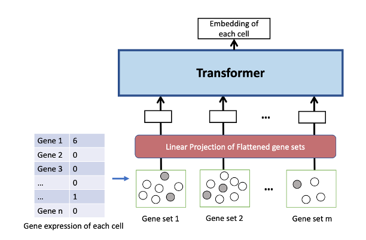
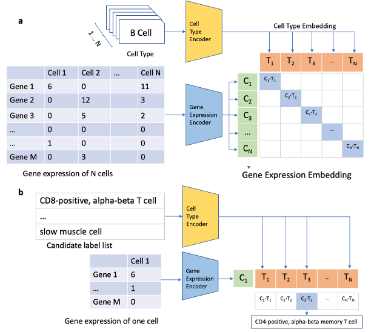

This repository contains the code for the paper "PathAligner: Aligning Cell Names with Gene Expression via a Pathway-Informed Trans-former". It contains the code of biological pathway-informed gene expression transformer model and contrastive cell-name-gene-expression learning framework for cell type annotation of single cell data.

The following figure shows the Pathway-informed gene expression transformer model: using biological pathways to group genes as super tokens and then apply transformer model to learn the gene expression representation.



This figure shows the architecture of PathAligner, the contrastive cell-name-gene-expression learning framework for cell type annotation of single cell data.



## install conda environment
```bash
conda env create -f environment.yml
```

## data preprocessing
1. Please download the raw data of Tabula Sapiens from [here](https://www.ncbi.nlm.nih.gov/geo/query/acc.cgi?acc=GSE201333)
2. Download the KEGG pathway data from [here](https://www.genome.jp/kegg-bin/get_htext?hsa00001+3101)
3. Follow the preprocessing steps in the "sc_data_processing_tabula_sapiens.ipynb" to generate the data for training and evaluation.

## run pretraining 
```bash
bash run_pretraining_clip_onclass.sh
```

## run testing
```bash
bash run_predict_clip_onclass.sh
```